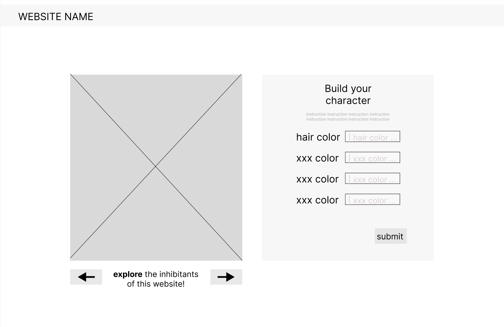
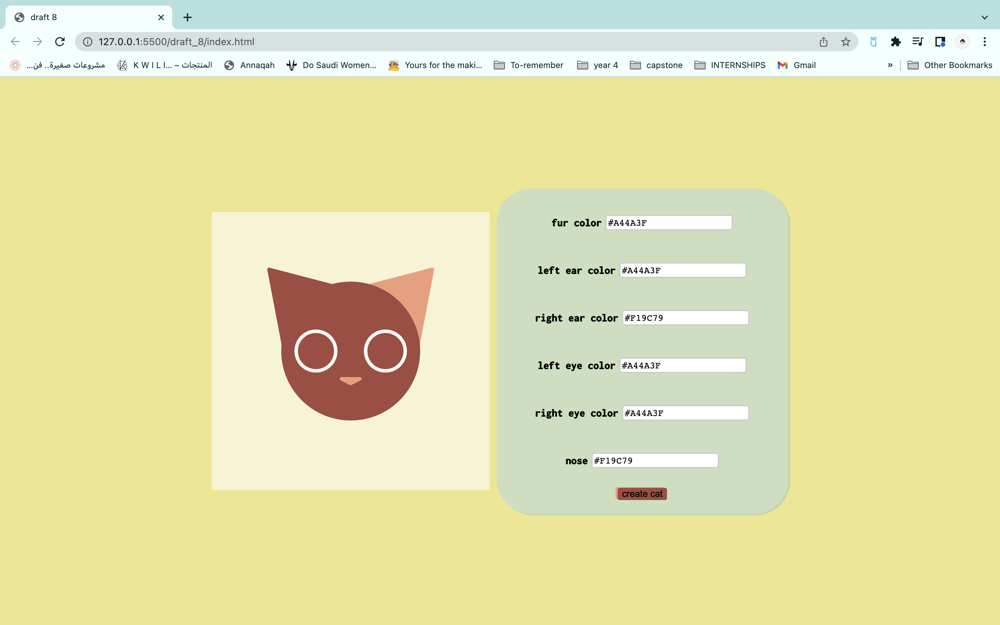
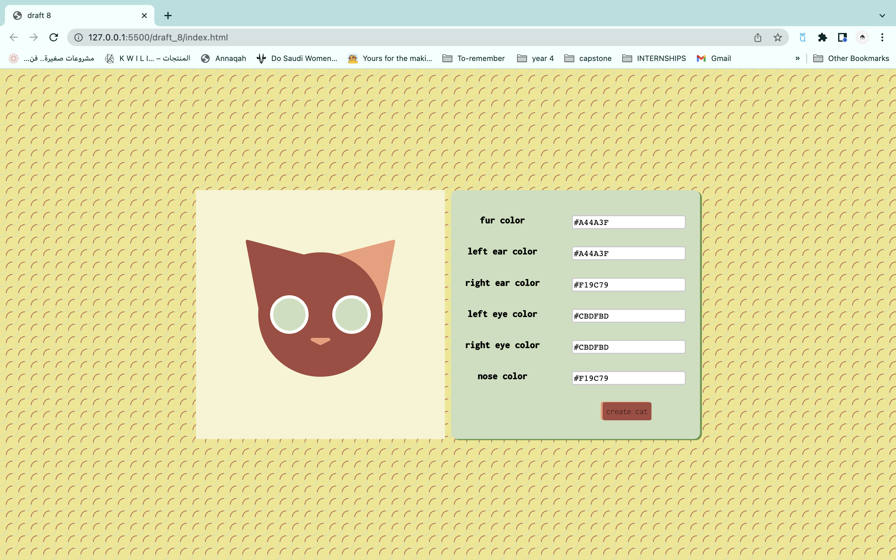
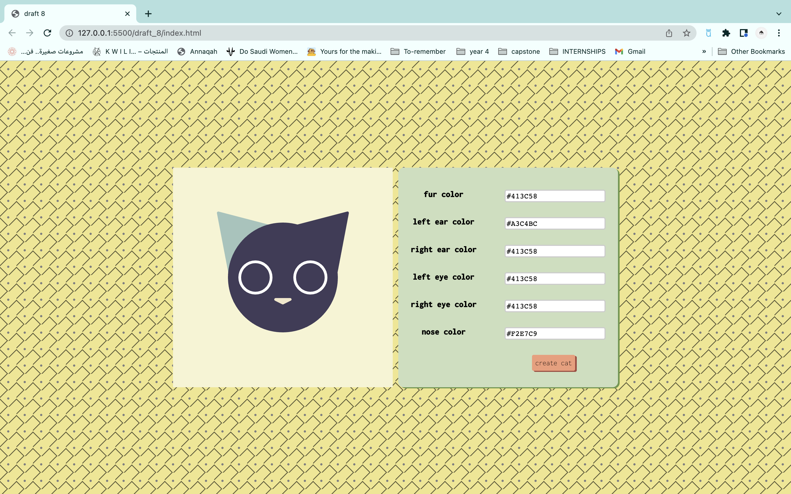
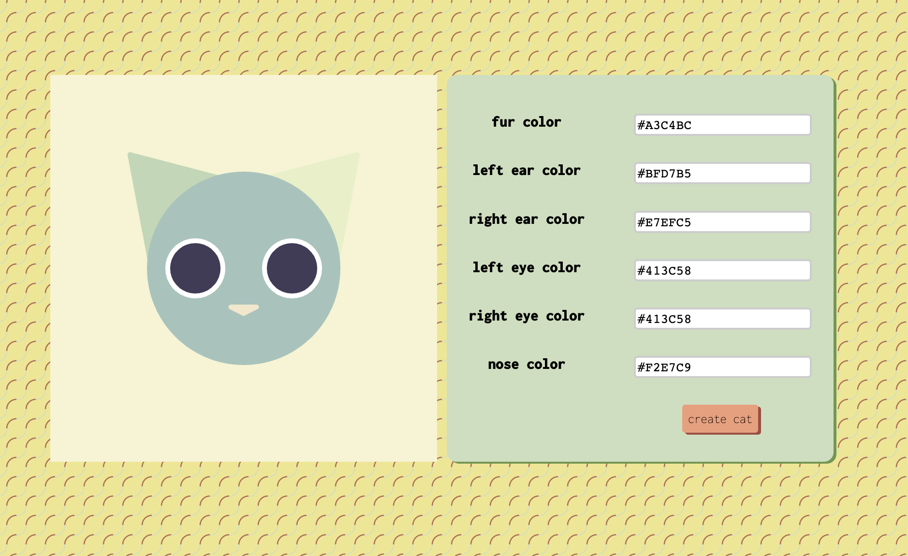

#Website Cats
## Idea
a place where people can create their own campus cat that would be added to the list of cats that inhibit this website.<br>
more information [here](https://docs.google.com/presentation/d/1DWSNe8sxxzLjyPBtTeupjfqZsejL5A5J2tTNxXQ_rIk/edit?usp=sharing)

## plan
- [x] learn to get data from google sheets
- [x] learn to write data into google sheets
- [x] figure out a way to display all the previous user's characters
- [x] figure out how to use the data from the sheets with p5js

## steps
### idea research
#### stage 1
I looked at many websites that used data to create an engaging experience. This is [one that I found interesting](http://rossgoodwin.com/clock/). 
I also found a [script of code that generated a json file with random values](https://www.google.com/url?q=https://json-generator.com/%23&sa=D&source=docs&ust=1663593434633689&usg=AOvVaw2qFZ_5_fmgeoMX7uwXj4jc). I thought I could use this to generate a list of charecter features and display them using p5js on the website.
Later I decided to allow the users to generate characters with select features and then be able to view all the previous charecters.
#### stage 2
Idea was changed to match a specific target audience. The final idea was a website called "Website Cats" where people create cats to grow the website cats community

#### target audience
people who live on campus and know about the campus cats
#### what would the website provide?
a place where people can create their own campus cat that would be added to the list of cats that inhibit this website.

### get data in google sheets
#### summary of steps
* create an API key and link for the [spreadsheet](https://docs.google.com/spreadsheets/d/1O6JPyFCfs4OPS5NSWxu3H6cqa-PM5uxz5VB8dJgQAq0/edit#gid=0) (through this [link](https://sheetdb.io/))
* this creates this [json file](https://sheetdb.io/api/v1/kiyrgijfayuro)
* then I would access this file in my javascript file
```
<!-- returns each row -->
for(let i =0; i <data.length;i++){ 
  console.log(data[i]);
}
```
[draft website](https://nouf-alabbasi.github.io/fall-2022_connection-lab/project_1/draft_4/index.html) that takes data from a spreadsheet and displays it in the html

#### steps in details
- this step was challenging because many of the tutorials I looked at had assumptions about what I know when it comes to APIs and js. so they went from 1 to 100 pretty quick when it comes to the difficulty.
- This meant that debugging was really hard
- for example this was a bug that I encountered, fixing it in my local device was easy, but then I need to understand how to fix the problem in general
    - [https://medium.com/@dtkatz/3-ways-to-fix-the-cors-error-and-how-access-control-allow-origin-works-d97d55946d9](https://medium.com/@dtkatz/3-ways-to-fix-the-cors-error-and-how-access-control-allow-origin-works-d97d55946d9)
- this is the final tutorial I decided to follow, debugging was really challenging
- I finally got it to ready the data, however getting the data displayed was the next challenge.
- (I wanted to display the data in a table so I can check that I am accessing the data right)
- I tried another tutorial
    - [https://www.bpwebs.com/pull-data-from-google-sheets-to-html-table/](https://www.bpwebs.com/pull-data-from-google-sheets-to-html-table/)
    - [https://www.geeksforgeeks.org/how-to-make-charts-using-data-from-google-sheets-in-javascript/](https://www.geeksforgeeks.org/how-to-make-charts-using-data-from-google-sheets-in-javascript/)


### write data into google sheets
I started to brain storm how the data from the user woud be entered. The idea I had of for this was an input text box. The problem with that the user could enter invalid color value. 
To solve this problem I have two options, use a [function that checks if the input is a valid color](https://stackoverflow.com/questions/48484767/javascript-check-if-string-is-valid-css-color), or use buttons with limited options that users can click.

### display all the previous user's characters
#### creating multiple canvases
I first wanted to check how p5js can be incorporated with html. Once I figured out how to do that in the first [draft of the website](https://nouf-alabbasi.github.io/fall-2022_connection-lab/project_1/draft_1/index.html), I now had to figure out how to display all the other user's charecters.<br>
One way was to display [mutliple canvases](https://nouf-alabbasi.github.io/fall-2022_connection-lab/project_1/draft_2/index.html) but that looked like it would get complicated and difficult to scale and manage really quicky.<br>
I ended up creating canvas instances everytime a button is pressed like in this [code](https://stackoverflow.com/questions/55384639/connecting-the-html-input-page-with-p5-js). <br>
```
canvas = new p5(function (p) {
      p.setup = function (){
        p.createCanvas(canvasWidth, canvasHeight);
        p.background("red");
      }
      p.draw = function(){
        p.background("#3ABEFF");
        p.stroke(0);
        p.rect(p.width/5, p.height/5, p.width/5 * 3, p.height/5 * 3);
     }
    }, "canvas-div");
```
([my innetial code is here](https://nouf-alabbasi.github.io/fall-2022_connection-lab/project_1/draft_6/index.html))I faced a problem where when I added in my  CreateCat function I was getting things like <b>StrokeWeight not defined</b> or <b>fill isn't defined</b>. I looked online but couldn't find a similar problem. I tried to add in the code in the draw function (that seemed like a good temparary solution becuase the fucntion is only written once and a for loop calls it repeatdly). However, when I tried to run it I got an erro; <b>Bakcground not defined</b>. This was intresting becuase it used to work fine, and I realized that I need to add <b>p.</b> before those the p5js functions I used for each canvas, so I recreated the CreateCat function with all the <b>p.</b> and it worked.<br> [Here is the current website.](https://nouf-alabbasi.github.io/fall-2022_connection-lab/project_1/draft_7/index.html) and after fixing the html [here](https://nouf-alabbasi.github.io/fall-2022_connection-lab/project_1/draft_8/index.html) is how it looks!


#### accessing data from the json file within the p5js code
The other idea was to create a carousel like element with buttons that could be increment and reduced an "index" value. and the "index" value would serve to represent the index of the row to be accesed.<br>
another issue here was that I so far can't access the vairables used in the fetch function in the p5js code. <br>

## design aspects
### initial wireframe
<p align="center">
  
</p>

### website stages
##### basic layout

<p align="center">
  
</p>

##### adding patters to the background

<p align="center">
  
</p>
<p align="center">
  
</p>

##### the pattern I decided on going with

<p align="center">
  
</p>


