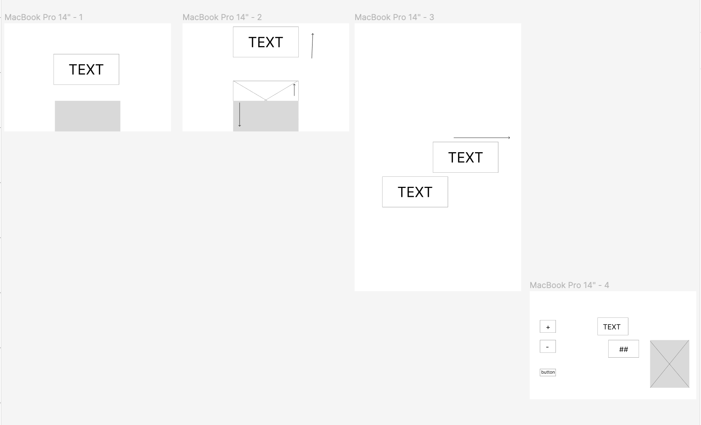
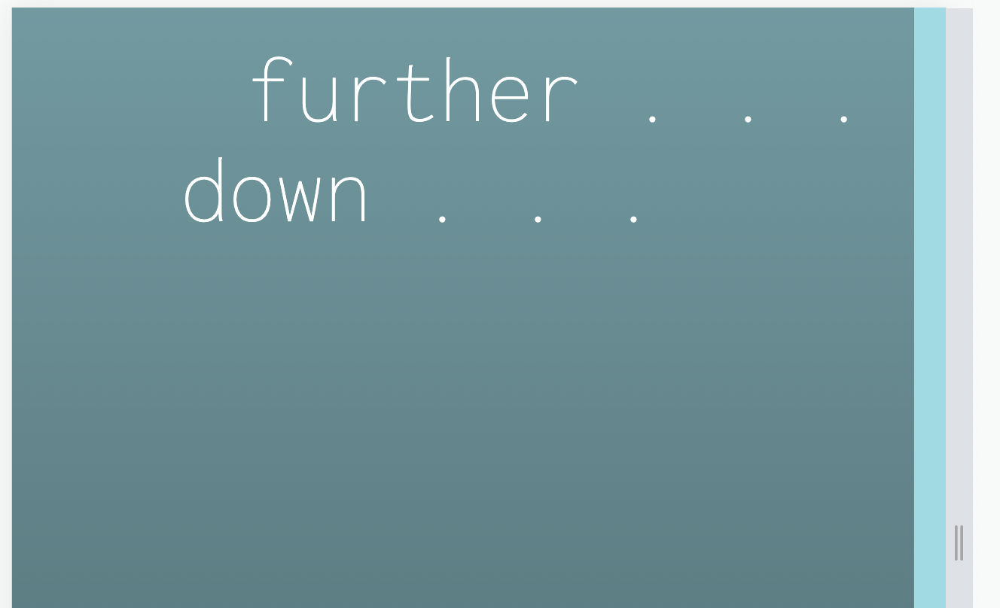
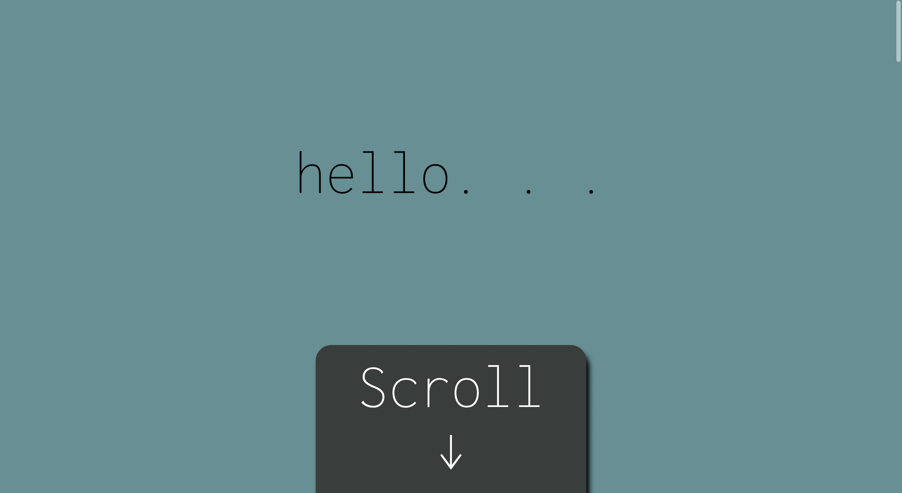
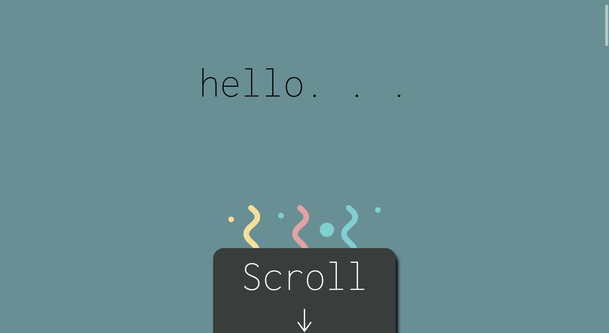
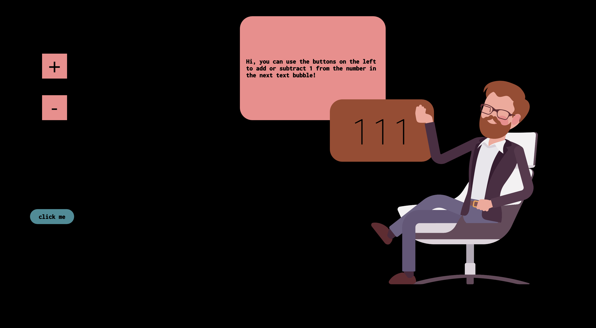
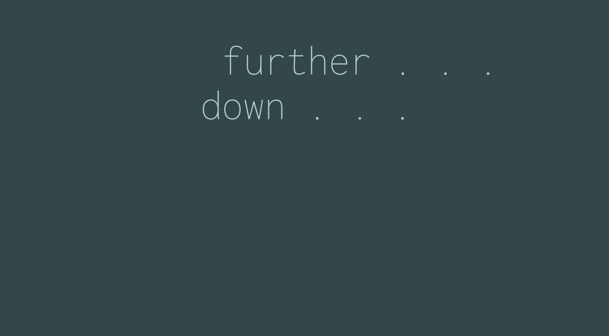

# js event listener

## Wireframe
I first used drew some wireframe ideas on sticky notes and lined them up to mimic scrolling and settled for this wireframe.

  

## creating the page
### challenge 1
There were a few challenges when it came to creating this page. I wanted to fade the darker part and the lighter part at the top. I tried to fade the div at the bottom into the lighter color. The issue here is that I needed to alter the color when the user clicks the botton at the end of the page, and I couldn't figure out how to reassign the gradient value as the background color. To solve this issue I used opacity and altered it as the user scrolled.  

  

### challenge 2
there is also the issue of the bottom div not fitting the entire screen after I minimize and expand it. I made sure that the width of the div is 100% or 100vw. I also made sure that the body's padding=0 or margin=0. At the end I tried to change body's overflowY to hidden, but none of that worked.

  

### the final website
The website starts with a box at the bottom of the screen, the word "hello" appears once the user scrolls a bit. Confetti appears from under the box and the box leaves the screen by going down.
then the user is prompted to continue scrolling and the webpage becomes darker. at the end there is a button and if the user presses it the room/office is lit up and a person appears and instructs the user to add or subract by pressing the + or - button.

  

  

  

  

